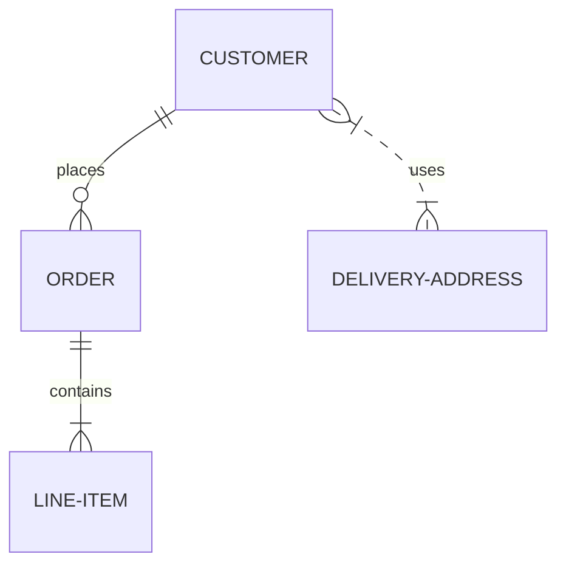

# maso-ware - un nome, una certezza

## Database ER diagram
Per realizzare il diagramma ho usato due differenti soluzioni:
- [SchemaSpy](https://schemaspy.org/) genera il diagramma e produce un documento HTML
    facilmente navigabile

- [mermaid](https://mermaid.js.org/syntax/entityRelationshipDiagram.html) comodo per
    tenere il diagramma aggiornato

### Diagramma ER

